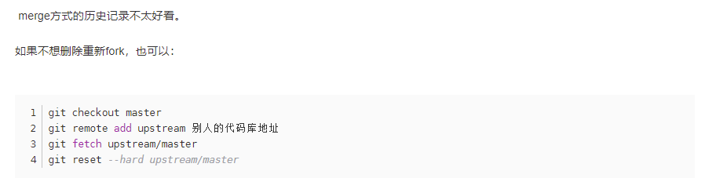

# 《前端也要会的编译原理之用 JavaScript 写一个 JavaScript 解释器》 课程课后作业

clone 本项目后根据 homework 目录下的 README.md 文件查看具体要求

## 作业提交指南

1. 将本仓库 fork 到自己的仓库下

2. 完成作业并且提交代码

    通过全部测试用例后将代码 push 到自己的仓库

3. 向本仓库提交 pull request

选择你要提交的分支，并根据提示完成

4. 进入 issue 中找到对应的作业提交安装模板提交作业

5. 提交后等待 code review 就好了

## 与brambles同步更新

1. fork过后添加原项目地址

   git remote add upstream git@github.com:bramblex/jsjs-homework.git

2. `git remote -v` 就可以看到一个origin是你的，另外一个upstream是原作者的。

3. 执行`git fetch upstream`命令，检出upstream分支以及各自的更新；

4. 切换到你的本地分支主干：`git checkout master`；

5. 合并`upsteram/master`分支和`master`分支,将原项目中的更改更新到本地分支，这样就能使你的本地的fork分支与原项目保持同步，命令:`git merge upstream/master`；

6. 执行`git push`将本地分支的修改推送到远端fork的项目；

7. **另一种方式同步更新**

   